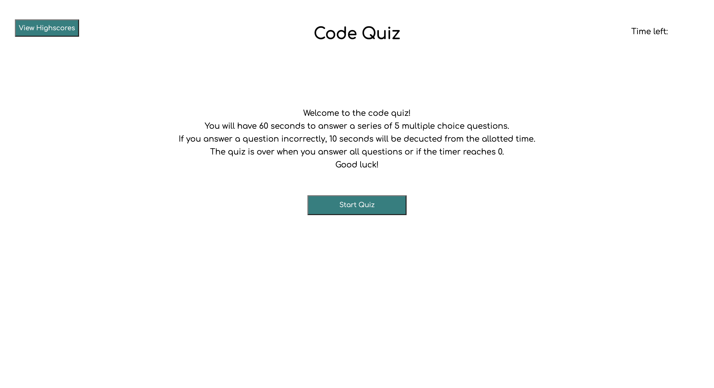
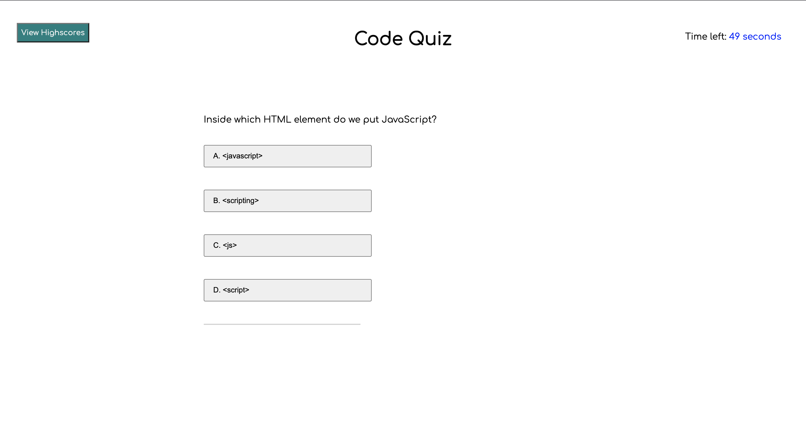
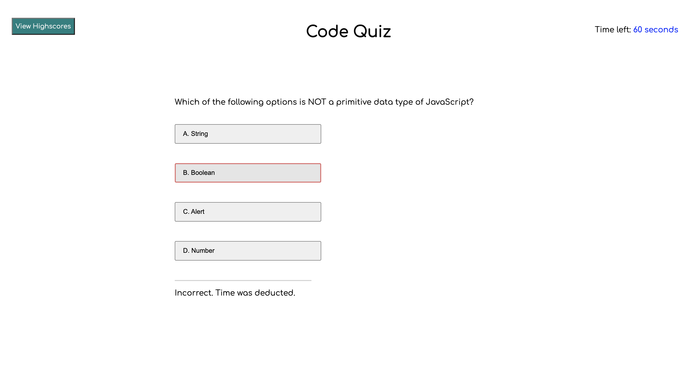
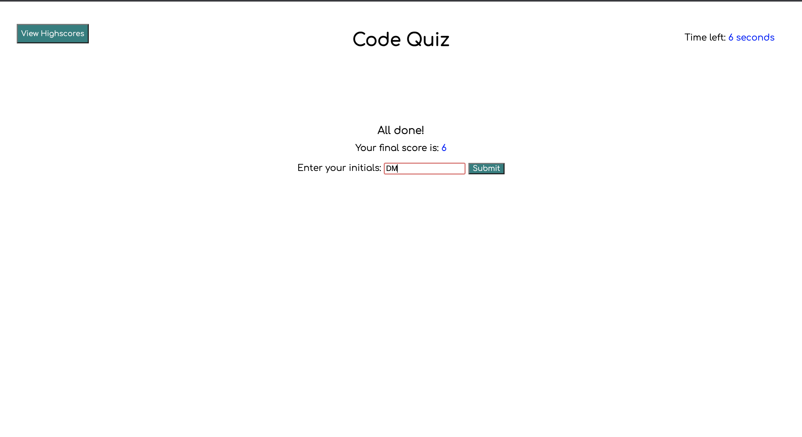
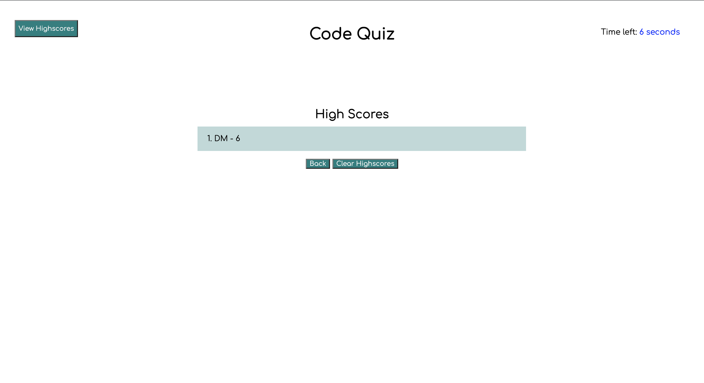

## Name 

Coding Quiz 

## Description

The goal of this project is to create a coding quiz using JavaScript and Web APIs to drive the logic and functionality. 

Upon rendering the page, the user will be presented with the instructions for quiz. The objective is to compelete the quiz with the highest amount of time remaining. After completing all 5 quiz questions or when the timer is depleted, it is game over. The user will be able to save their initials and score at the end of the quiz. They will also be able to view the highscore list using the button in the header, as well as clear the current list of highscores. 

## Installation 

N/A 

## Usage 
Use the following link to access the deployed webpage: 

https://dymoy.github.io/code-quiz/

The source code is found in the root directory of the main branch. 

## Visuals 

### Screenshot of webpage upon rendering 

### Screenshot of the webpage after starting the quiz

### Screenshot of the webpage after answering a quiz question correctly 

### Screenshot of the webpage after finishing the quiz

### Screenshot of the webpage viewing the highscores 

## License 

Please refer to the license in the repo.
